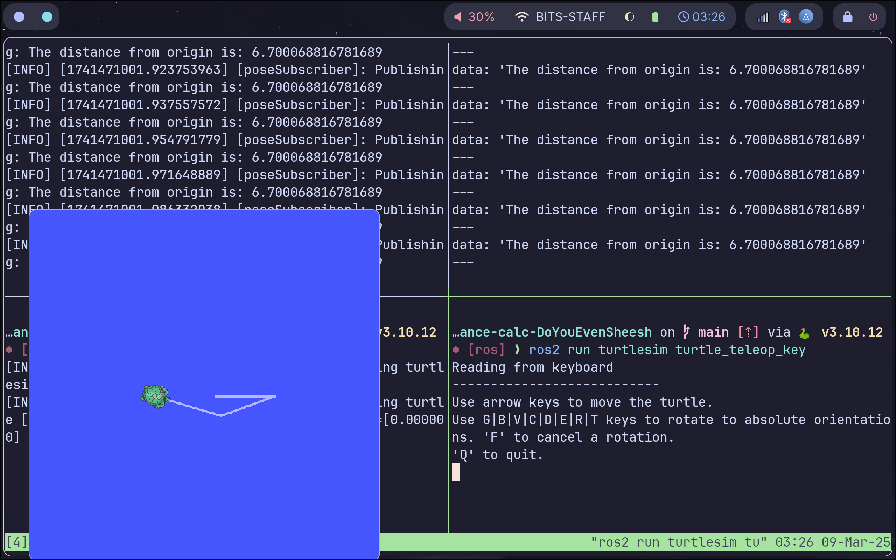

## Sample Output



[](https://classroom.github.com/a/0ILR5htM)
# Task1

## Installation

Follow the appropriate installation guide based on your ROS2 version:

- **ROS2 Foxy:** [Installation Guide](https://docs.ros.org/en/foxy/Tutorials/Beginner-CLI-Tools/Introducing-Turtlesim/Introducing-Turtlesim.html)
- **ROS2 Humble:** [Installation Guide](https://docs.ros.org/en/humble/Tutorials/Beginner-CLI-Tools/Introducing-Turtlesim/Introducing-Turtlesim.html)
- **ROS2 Jazzy:** [Installation Guide](https://docs.ros.org/en/jazzy/Tutorials/Beginner-CLI-Tools/Introducing-Turtlesim/Introducing-Turtlesim.html)

## Running Turtlesim

Launch the Turtlesim node:

```bash
ros2 run turtlesim turtlesim_node
```

List available topics:

```bash
ros2 topic list
```

Expected output includes:

```
/turtle1/cmd_vel
/turtle1/color_sensor
/turtle1/pose
/parameter_events
/rosout
```

The topic `/turtle1/pose` publishes the position `(x, y)`, linear velocity, and angular velocity of the turtle.

To view the published messages:

```bash
ros2 topic echo /turtle1/pose
```

## Task: Distance Calculation and Publishing

Create a ROS2 subscriber that:
1. Subscribes to `/turtle1/pose`.
2. Extracts the `(x, y)` position.
3. Computes the distance from the origin `(0,0)`.
4. Publishes the computed distance to a new topic `/turtle1/distance_from_origin`.

## Submission Requirements

- Upload the Python file(s) implementing the subscriber and publisher.
- Provide a screenshot displaying the topic output in the terminal.

